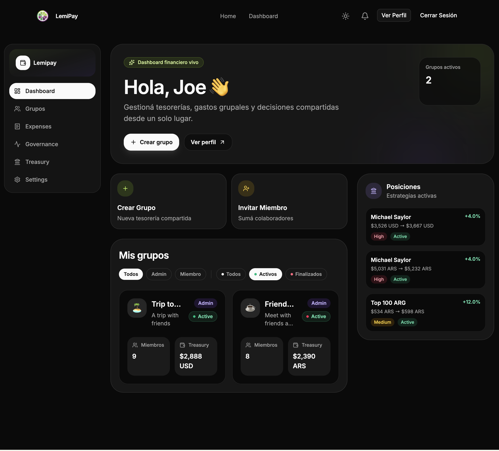

# mateodiaz.tech — Portfolio Setup

## Estructura de archivos

```
/
├── index.html          ← el portfolio
├── cv-en.pdf           ← tu CV en inglés (agregar)
├── cv-es.pdf           ← tu CV en español (agregar)
└── images/
    ├── lemipay.png     ← screenshot de LemiPay
    ├── movieweb.png    ← screenshot de MovieWeb
    ├── coexist.png     ← screenshot de Coexist
    └── equadris.png    ← screenshot de Equadris
```

## Cómo agregar imágenes a los proyectos

En el HTML, buscá los comentarios `<!-- ADD YOUR IMAGE -->`.
Por ejemplo, para LemiPay:

```html
<div class="project-img-placeholder">
  <!-- Descomentá esto y borrá el span: -->
  
</div>
```

## Cómo agregar los CVs

Simplemente poné los archivos PDF en la raíz del sitio con los nombres:
- `cv-en.pdf` (inglés)
- `cv-es.pdf` (español)

Los botones de descarga ya están apuntando a esos paths.